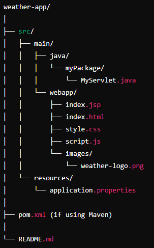
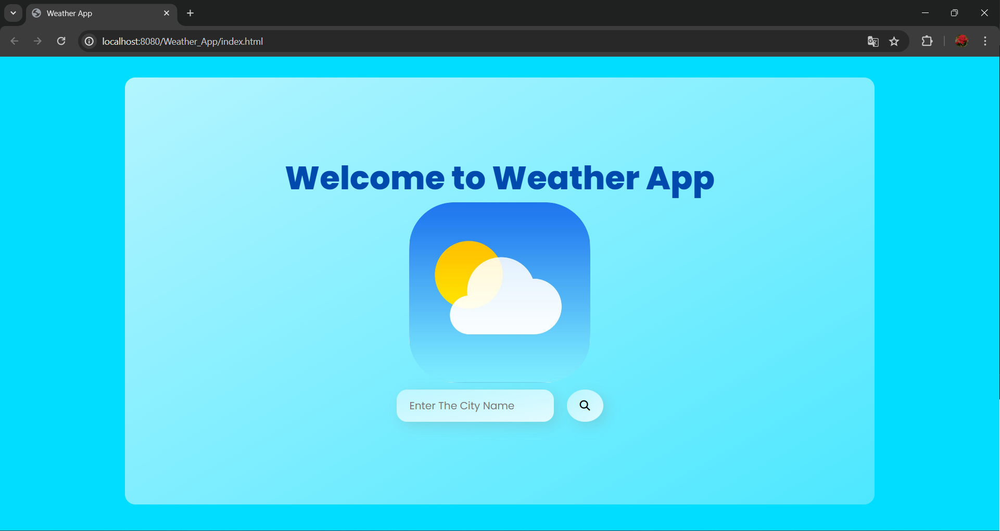
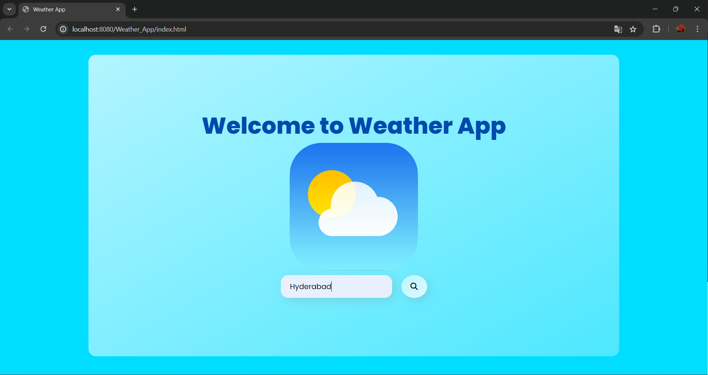
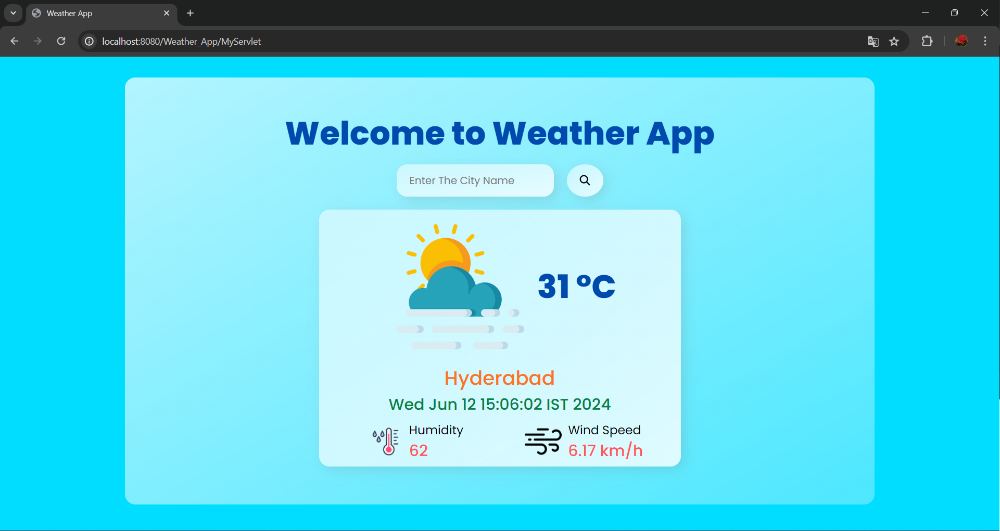
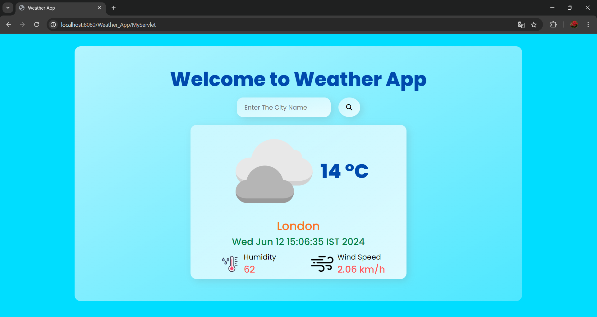
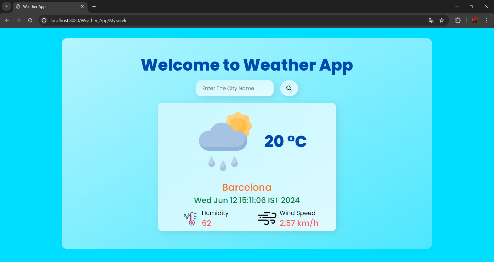
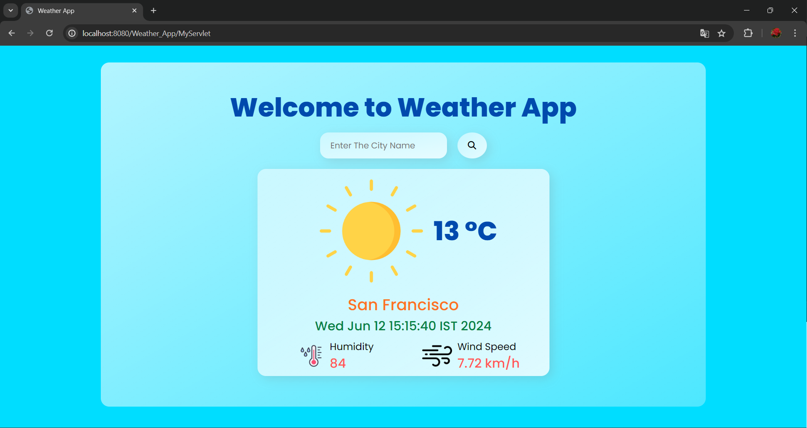

# Weather App

## Introduction

The Weather App is a web application that allows users to enter a city name and retrieve real-time weather information for that city. The application fetches weather data from the OpenWeatherMap API and displays it to the user, including temperature, humidity, wind speed, and weather conditions.

## Project Structure




## Technologies Used

- HTML
- CSS
- JavaScript
- JSP (JavaServer Pages)
- Java Servlet
- OpenWeatherMap API

## Setup and Installation

### Prerequisites

- Java Development Kit (JDK) installed
- Apache Tomcat server installed
- Internet connection for API requests

### Steps

1. **Clone the repository:**

   ```bash
   git clone https://github.com/yourusername/weather-app.git
2. **Navigate to the project directory:**

   ```bash
   cd weather-app
3. **Set up your development environment:**
   - Make sure your Java IDE (e.g., IntelliJ IDEA, Eclipse) is set up with the necessary plugins for Java EE and web development.

4. **Deploy the project on Tomcat server:**
   - Copy the project directory to the webapps folder of your Tomcat installation directory.
   - Start the Tomcat server using the startup script (startup.sh or startup.bat depending on your OS).

5. **Open the application in your browser:**
   - Navigate to http://localhost:8080/weather-app in your web browser.

## File Descriptions

### index.html
This file contains the HTML structure of the homepage. It includes a form where users can input the name of a city to get weather information.
### style.css
This file contains the CSS for styling the HTML elements, including layout, colors, fonts, and responsive design.
### script.js
This file contains the JavaScript code for handling client-side logic, such as dynamically updating the weather icon based on the weather condition.
### index.jsp
This JSP file dynamically displays the weather data fetched from the OpenWeatherMap API. It uses JSP expression language to embed data into the HTML.
### MyServlet.java
This Java servlet handles POST requests from the form submission. It calls the OpenWeatherMap API with the city name, processes the JSON response, and forwards the data to index.jsp.

## How to Use
1. Open the application in your web browser.
2. Enter the name of a city in the input field.
3. Click the search button.
4. View the current weather information for the entered city.

## Output Screenshots














